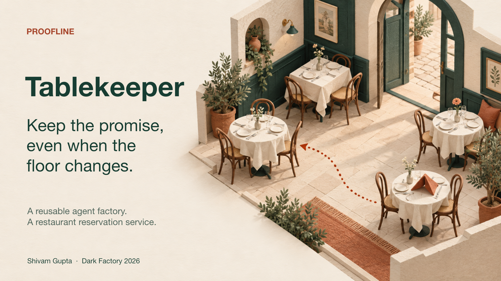

# Tablekeeper



**Keep the promise, even when the floor changes.** A reservation is a promise to a guest. Tablekeeper helps a restaurant keep that promise through booking changes, evolving policies and table closures.

This repository is the Tablekeeper-track output of **Proofline**, a four-seat software factory. Shivam Gupta supplied product direction and factory configuration; Proofline's coding-agent seats implement and independently verify the software. See [FACTORY.md](FACTORY.md) for setup, responsibilities and release gates.

Start with the [three-minute evidence guide](docs/JUDGE-GUIDE.md), [captioned demo video](output/video/final/proofline-tablekeeper-demo.mp4), or [presentation PDF](output/pdf/proofline-tablekeeper.pdf). The video includes an authentic BAND Desktop room recording and a working reservation-repair walkthrough.

Explore the [deployed companion](https://tablekeeper-proofline.web.app) using the [hosted walkthrough](docs/HOSTED-TESTING.md). The separate companion is accepted and its cloud backend is verified. Firebase Hosting is live, and the public-origin HTTP and Chrome checks passed. The video demonstrates the original accepted local stage. [Hosted verification](evidence/hosted/browser-check.json) records the tested flows and limits at source revision `053ae0d`.

## Read the repository

- `stage-1/`: clean-room reservation API, retry receipts, atomic multi-booking moves and state transfer.
- `stage-2/`: the accepted predecessor extended with combined tables and a resilient browser booking experience.
- `stage-3/`: effective-dated policies, accepted terms, history and recurring bookings.
- `stage-4/`: optimal closure planning, atomic seating repair and recurring amendments.
- `mandates/` and `factory/`: reusable seat instructions, identities and the original production dispatch.
- [Release ledger](docs/RELEASE-GATES.md): requirement families, accepted revisions and evidence status.
- [Security boundaries](docs/SECURITY.md): judge controls, private exports and deployment limitations.

The four folders are complete, independently buildable sequential releases. Each extends its accepted predecessor. Exact accepted revisions, independent review and final execution results are in the [release ledger](docs/RELEASE-GATES.md) and [final verification report](evidence/final/verification.md). The authentic full [BAND room export](room.json) contains 3,540 messages and was exported after completion. The original run needed an operator daemon/session restart, disclosed in [FACTORY.md](FACTORY.md); no additional human implementation task or hint was sent.

## Verification

The official contracts are from kickoff revision `803560d2a678ace1414465c098eb0ab5380ffade`. From that checkout, with its prepared Python environment and Docker running:

```sh
.venv/bin/python -m harness run --track tablekeeper \
  --repo /absolute/path/to/this/repository --all --mode isolated \
  --out /absolute/path/to/a/new/check-directory
.venv/bin/python -m harness check /absolute/path/to/this/repository --track tablekeeper
```

Every run needs a new output directory. Published checks are partial; independent specification-derived checks and source review are also required. Final isolated execution passed 120, 145, 152 and 158 required checks for stages 1 through 4 respectively, both in the workspace and a fresh local clone: 575 check executions per run, not 575 distinct requirements. The published suites are partial. Historical submission-check logs predate the final room export. The [post-export public-clone check](evidence/final/public-clone-check.md) passed from an unauthenticated GitHub clone, with matching stage trees and room hash.

Run the accepted browser product locally:

```sh
docker build -t tablekeeper-stage-4 stage-4
docker run --rm -e PORT=8080 -p 127.0.0.1:8080:8080 tablekeeper-stage-4
```

Open `http://localhost:8080`. See [demo runbook](docs/DEMO-RUNBOOK.md) for the exact synthetic account and scenario, and each stage's `RUN.md` for options. The judge image intentionally enables unauthenticated test controls. It must not be exposed publicly in that mode.

## Product boundary and next step

The accepted stage-4 product includes guest signup/login, booking and lookup, recurring administration, manager closure preview/apply, and responsive browser flows. Its recovery planner supports at most **6 tables, 4 declared pairs and 6 considered bookings**. All confirmed bookings overlapping the closure count, including those on unaffected tables; splitting arbitrary overlapping plans is not a validated extension.

The graded service keeps state in memory and enables judge test controls by default. It is a local demonstration and contract implementation, not a durable public restaurant service. The separate `product/` companion adds durable storage and operational browser flows. It has independent acceptance and a verified cloud backend, deployed through Firebase Hosting with passing public-origin HTTP and Chrome checks. Its acceptance does not replace or extend the original graded results. No production certification is claimed. Individual booking amendment is API-only in the frozen product, and amended-series summary refresh has a documented UX limitation.

Our proposed first pilots are intimate four-to-six-table venues with direct or recurring groups. The proposed $79/location/month is a hypothesis, not customer revenue. Read the [commercial thesis](docs/COMMERCIAL-THESIS.md), [submission copy](docs/SUBMISSION.md), and [video script](docs/VIDEO-SCRIPT.md).

Original project code is [MIT](LICENSE). Official specification text retained in the room export keeps its upstream license; see [third-party notices](THIRD-PARTY-NOTICES.md).
